# Midterm Report & Presentation

## MBTA Bus Arrival Departure Dataset

### Basic Introduction of Datasets

We have access to the expected and actual arrival data everyday from the year 2018-2025. The detail of the data is in minute accuracy and provides a lot of detailed information.

### Preliminary visualizations of data & Detailed description of data processing done so far

A lot of the data processing was a direct consequence by looking at visualizations of data. For example, we later mention how date and time is formatted in the dataset. The format of the data was in DATE (i.e. 2024-01-07) with an included scheduled and actual stop TIME (formatted in 1900-01-01T00:00:04:00Z). The initial dataset was merged to slice off the 1900-01-01 and append the date to the time. But this proved to be inaccurate and was found thanks to visualizations when we visualized lateness over time.

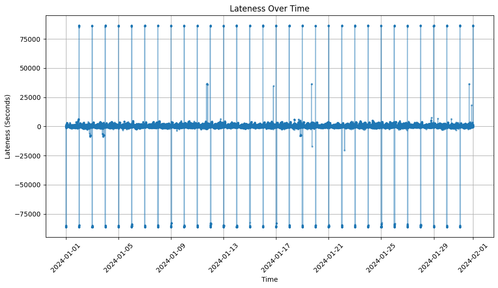

The graph above showed very weird consistent pattern of outliers. After writing down these outliers in a csv, we see that the outlier values were around 86400, which is equivalent to being one day late. By visualizing our data, we were easily able to find taht sometimes, if the expected and actual dates are different, the data is formatted so that the day that comes after is formatted as (1900-01-02T00:00:00z).

We then decided to graph the new formatted data that was now fixed. We still see there are outliers and that there are mutliple outliers back to back as shown in the graph below.

We then created a new csv looking for the outlier rows which showed that these outliers and we see they are from the same station back to back. But the intervals between the actual bus time arrivals are the same as the intervals between expected bus time arrivals. We believe that this is most likely some announced shift in the schedule that was not reflected in the spreadsheet. We decided to put an arbitrary threshold of 3600 seconds (1 hour) of lateness or earliness. After we had removed obvious outliers from our dataset, we ended up with the a visualization of the data that looked like the graph below.

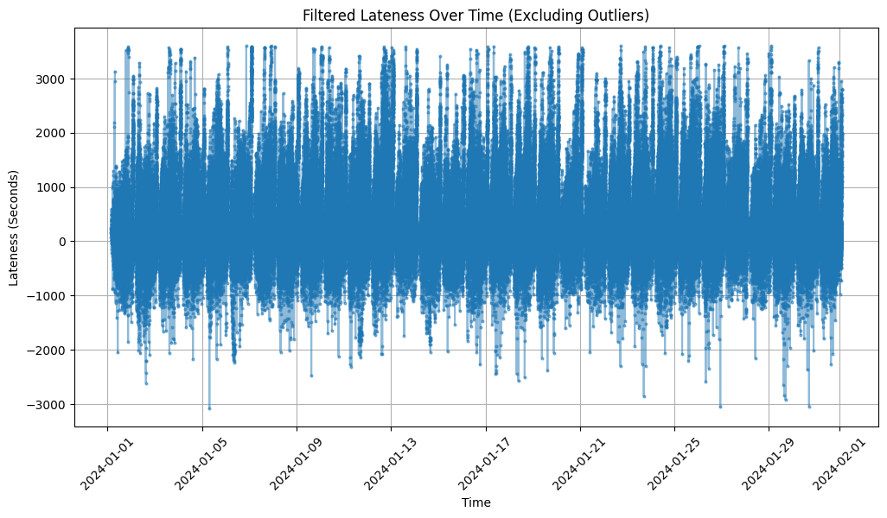

We felt the the data looked good enough that we were able to display it onto [ARCGIS](https://bucas.maps.arcgis.com/apps/mapviewer/index.html?webmap=9f60b58427e94c3991bba8cbce9f61ff). The map has a time series player as well and although we've only added 2024 data, the process can be extended to any other year.

We were also able to answer some the questions asked in our initial project proposal such as what is the city wide average lateness which happened to be around 263 seconds late. We were also able to see the average lateness for the target routes asked from the proposal.

| Route ID | Average Lateness (seconds) |
| -------- | -------------------------- |
| 111      | 194.24                     |
| 14       | 292.64                     |
| 15       | 269.35                     |
| 17       | 364.53                     |
| 22       | 380.97                     |
| 23       | 373.58                     |
| 24       | 375.41                     |
| 26       | 154.65                     |
| 28       | 446.06                     |
| 29       | 470.34                     |
| 31       | 258.83                     |
| 33       | 181.59                     |
| 42       | 313.53                     |
| 44       | 403.23                     |
| 45       | 361.81                     |

Again, the data above is from 2024 only as the time it would take to process all the datasets would take a while. But we felt that since this is a midterm report, we can show the result for one year and then process all the data during the final presentation.

### Detailed description of data modeling methods used so far.

Since we weren't given a explicit means to model our data, we'll be taking creative liberties on what type of model we should use. We could have used one of many different ideas such as prediciting the next delay for a bus stop given a certain number of previous delays, but given the nature of the project, we can look to identify areas that could use more attention by the MBTA to promote equity. One of the main ways to do this is by identifying areas and stops in Boston that are disproportionately affected by poor bus service. By looking at groups of stops, we can focus on areas that are being affected rather than one-off stops with poor service. We can use clustering such as KMeans or DBScan to see which areas have unusually poor service.

We approached this by first using KMeans without any form of normalization. The features included the average lateness, longitude, and latitude. Since the data isn't normalized, the lateness is the only thing that becomes the focus as lateness ranges from -300 to 300 while latitude and longitutde stayed within 41 to 42 and -71 to -72. This can be shown below.

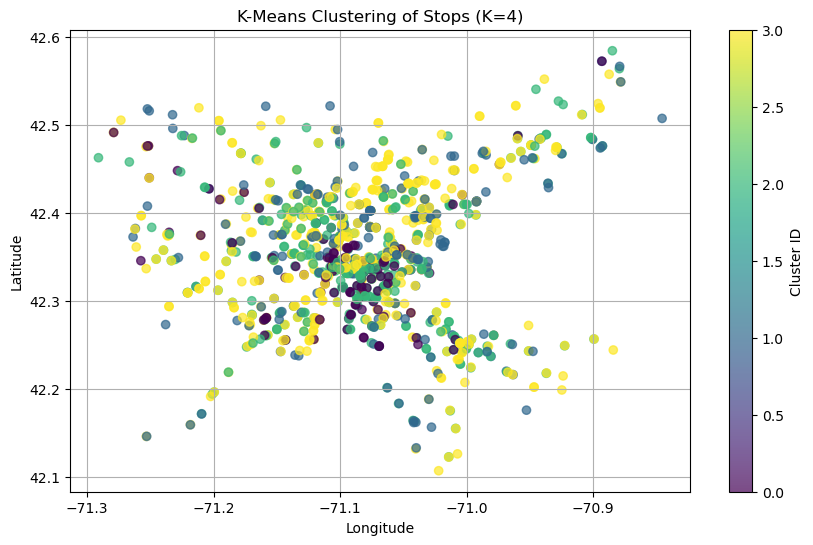

We then try adding normalization to ensure that location is being factored and we can see that the clusters begin to actually factor in distance. We also add the elbow method by looking at different cost functions after applying different number of clusters. We then decided that 7 clusters was the best choice. The 2 graphs below demonstrate this.

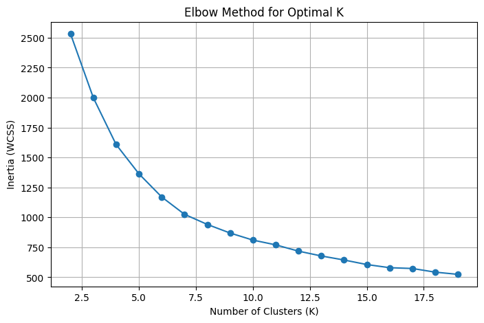

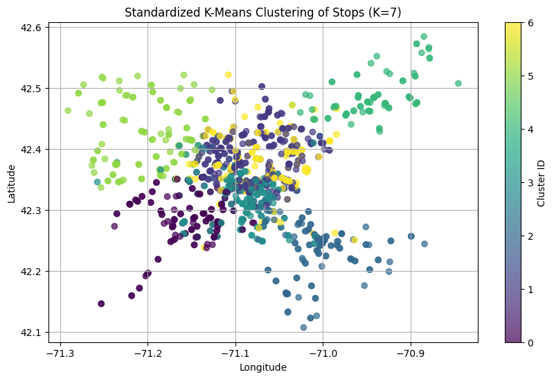

We then did the same with DBScan. The parameters were picked by looking for clusters that would have high average_lateness and non-trivial amount of stops. By manually messing around with the epsilon and min_samples parameter, we landed on 0.2 and 7 respectively.

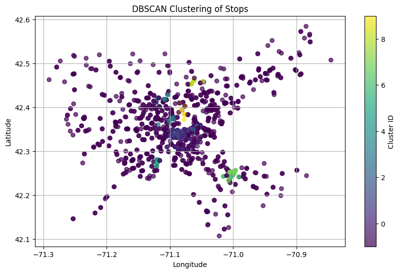

### Preliminary results. (e.g. we fit a linear model to the data and we achieve promising results, or we did some clustering and we notice a clear pattern in the data)

After obtaining both DBScan & KMeans, we noticed that the cluster with the most amount of lateness resided in similar spots and used ArcGIS to determine where this actually was on the map.

Below are the KMeans and DBScan results. We see that areas that have high levels of lateness identified by both DBScan and KMeans

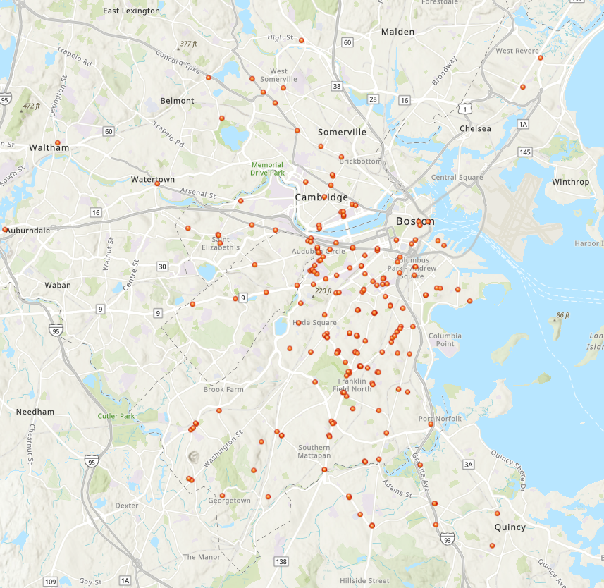

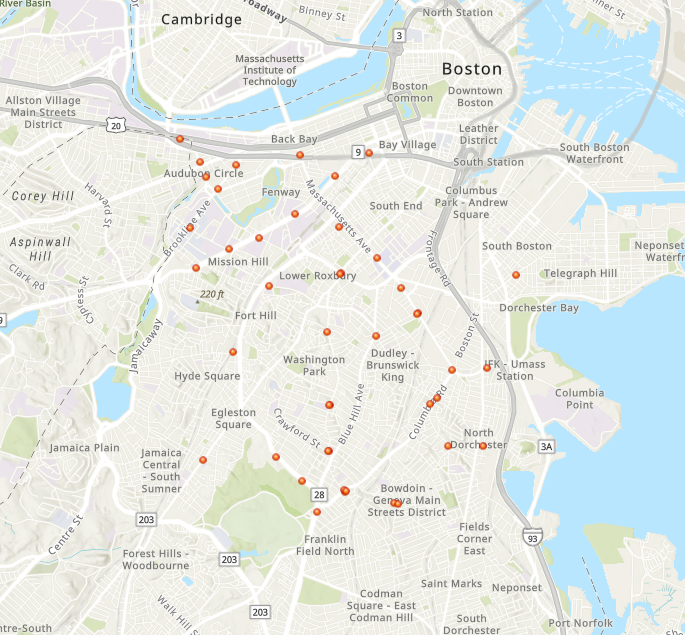

From immediate observations, we notice from our results that the southern area of Boston has the most delays in bus stops. Any outlier from DBScan is also included within KMeans. There could be multiple factors that contribute to this. More people could have cars in this side of Boston that cause traffic jams, people from Southern Boston commute to central Boston more than the North. It s hard to tell from the data here alone, and we'll need to combine with our census data to get a better understanding of what the data here could mean.

# Rider Survey Data Integration and Analysis

To explore which rider characteristics are most correlated with bus lateness, we utilized both pre-COVID (2015–2017 survey + 2018 arrival/departure data) and post-COVID (2023) MBTA datasets.

## Data Collection & Processing

**Post-COVID (2023):** The rider demographic data was available in CSV format. We filtered for `service_mode = Bus`, dropped nulls, standardized category names, and computed the percentage of riders per demographic category.

**Pre-COVID (2015–2017):** These were extracted from multiple Excel exports, which weren’t available in a file format, from CTPS's MBTA Survey Dashboard, accessed using a `requests-html + pyppeteer` scraper (`rider_survey_scraper.py`). Because the data was in raw counts, we normalized values by row to compute category-level percentages per route.

To match pre- and post-COVID datasets, we aligned category naming conventions using a full-category mapping, looking at the measure group (i.e. `access_mode`) and measure (subcategory), allowing for comparison across surveys.

## Pre- vs. Post-COVID Category Comparison

We generated comparison tables for the different category distributions before and after COVID. Some of the most significantly changed categories include:

- **Trip Purpose:** Home-based Work
- **Trip Frequency:** 5 days a week
- **Fare Type:** Monthly Pass

These shifts suggest meaningful changes in travel habits and fare usage, likely related to remote work adoption and economic impacts post-COVID.

## Lateness-Weighted Category Analysis (Post-COVID)

Using 2023 arrival/departure records, we calculated average lateness per route (after removing outliers beyond an hour). Routes with above-average lateness were selected and cross-referenced with demographic data to identify groups most affected by unreliable service.

We visualized the top 3 categories in each demographic measure group on high-lateness routes. Among the highest were:

- **Access:** Walked or Bicycled
- **Alternative Mode:** No
- **Income:** Yes (low-income)
- **English Ability:** Never

These highlight populations that may be most transit-dependent or face language barriers.

We performed **KMeans clustering** on route-level demographic features and found three clusters with clearly different lateness profiles. A **PCA projection** confirmed separability between clusters — with Cluster 2 having the highest average lateness and the most marginalized rider profiles.

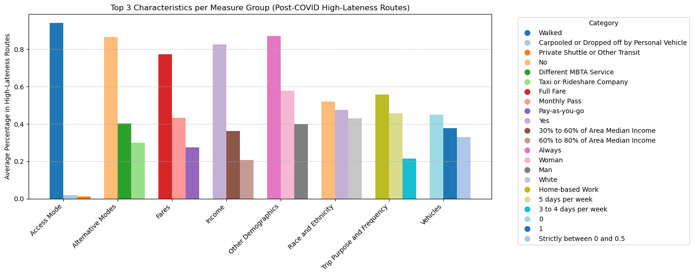

## Lateness-Weighted Category Analysis (Pre-COVID)

Since arrival/departure data was not available for 2015–2017, we used **2018 MBTA arrival/departure records** to estimate pre-COVID lateness.

After computing average lateness per route, we identified routes with above-average delays and isolated their rider survey responses (from the 2015–2017 survey). We then used aggregation and ranked the top demographic categories with these high-lateness routes.

Examples of top pre-COVID categories:

- **Trip Purpose:** Home-based Work
- **Low-income:** No
- **Access:** Walked or Bicycled
- **License:** Yes

## Pre vs. Post-COVID Change in Top Categories

To assess how key demographics on high-lateness routes shifted over time, we:

1. Matched top categories (by average percentage) from the pre-COVID high-lateness routes.
2. Looked up the same categories on post-COVID high-lateness routes.
3. Calculated the percentage point change from pre- to post-COVID.

This change was visualized in a bar graph grouped by survey measure (e.g., "fares", "access_mode", "race_and_ethnicity"). Notable trends included:

- **Increases** in non-English speakers and riders without alternative modes.
- **Declines** in licensed drivers and higher-income riders on late routes.

This comparison suggests how COVID-19 may have intensified the inequities already faced by riders on underperforming routes.

# MBTA Ridership Dataset

## Basic Introduction of Data 
For the ridership data, we have accumulated data from 2016 - 2024 regarding the number of people who have boarded and exited at a given stop. There are two separate notebooks that were used to show this. One was the ridership which finds the objective value change before and after COVID that uses boardings.

## Data Processing 

### Notebook 1:  
This process was generally straightforward with removing NaN values. In order to see the effect of COVID, we processed so that the groups would be averaged from the previous to 2019 and post 2019. As such, the first notebook is simply removing other needless variables and isolating the important variables we wanted to see. In this notebook, we implemented a new variable called `absolute_change` that was made for each existing `route_id`. For broad generalizations, this notebook is almost complete with some minor fixes necessary for submission later. 

### Notebook 2:  
This process took a little longer as it requires us to cross reference another csv file called `stops`. Similar to lateness, ARCGIS takes in coordinates, so we simply matched the stop id to a specific coordinate. We combined the population who boarded and exited to generate a new term called `traffic` for the second notebook. This one is more specific to say that a given stop has some amount of traffic. 

## Detailed Description of the Data Modeling Methods Used  
For modeling, we used **KMeans** initially without doing any normalization. In the first **KMeans**, the features include all metrics we have left in the model being just the latitude, longitude, and traffic. Similar to lateness, we see similar results where this clustering is mainly based on traffic.  

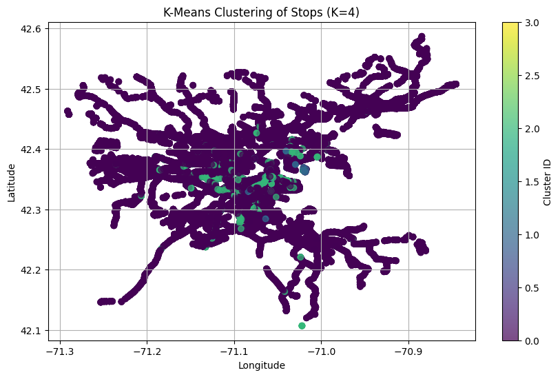  

We then added normalization to make sure all factors are being considered. After using the elbow method, we find that the optimal number of clusters is seven as shown below.  

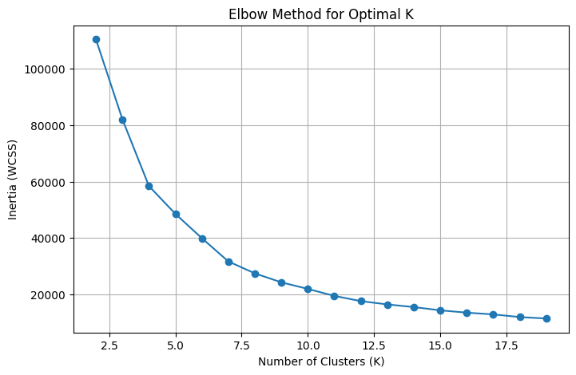  

With seven groups, we have it output the image below. The groups become more clear, and the general locations seem to be more important when considering how the points were clustered.  

| Cluster | Traffic      |
|---------|-------------|
| 0       | 748.375705  |
| 1       | 67.359137   |
| 2       | 34.573867   |
| 3       | 2569.139219 |
| 4       | 51.438401   |
| 5       | 7772.638095 |
| 6       | 28.334925   |

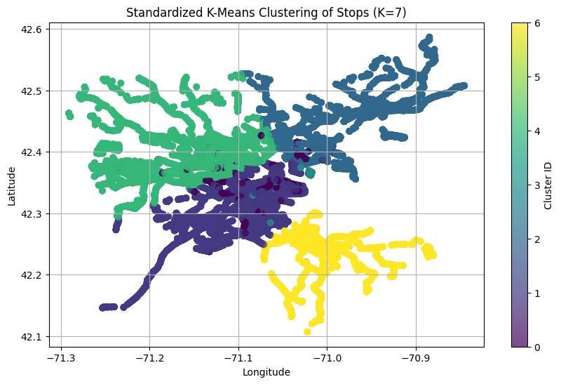  

After seeing those results, we then tried using a **DBScan**, but this process still needs to be explored further since the current output does not help us deduce more about the data we are working with.  

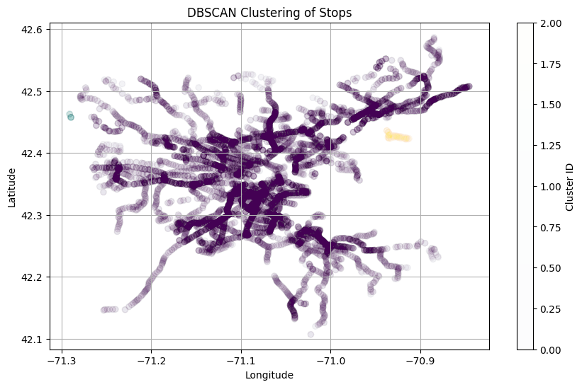  

## Preliminary Results  

In terms of ridership, we found that in terms of absolute ridership, the amount of people riding the bus has decreased after COVID. This is clear when we look at the ridership notebook. The traffic for stops seems to be greatly divided where there are some groups seeing thousands of riders in a season and others seeing fifty. **Cluster 5** in particular seems to have the most riders. This cluster is located in the **Back Bay area up into the Bay Village area**. To have a comprehensive understanding of the problem, we will be combining this data with the other sets of data to draw better conclusions for our final report.
