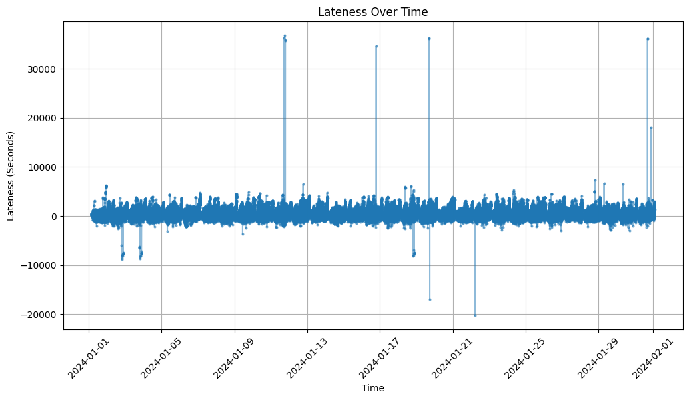

# Midterm Report & Presentation

## Basic Introduction of Datasets

### MBTA Bus Arrival Departure Dataset

We have access to the expected and actual arrival data everyday from the year 2018-2025. The detail of the data is in minute accuracy and provides a lot of detailed information.

## Preliminary visualizations of data.

### MBTA Bus Arrival Departure Dataset

A lot of the data processing was a direct consequence by looking at visualizations of data. For example, we later mention how date and time is formatted in the dataset. The format of the data was in DATE (i.e. 2024-01-07) with an included scheduled and actual stop TIME (formatted in 1900-01-01T00:00:04:00Z). The initial dataset was merged to slice off the 1900-01-01 and append the date to the time. But this proved to be inaccurate and was found thanks to visualizations when we visualized lateness over time.

The graph above was showing that certain stops were late by

Sometimes, if the expected and actual dates are different, the data is formatted so that the day that comes after is formatted as (1900-01-02T00:00:00z).

## Detailed description of data processing done so far.

### MBTA Bus Arrival Departure Dataset

There was a lot of data processing to be done. The format of the data and time mentioned above was an unintuitive form of writing data and hard to graph so the data was parsed so that we merged the date and time to create only expected and actual date and time comined (i.e. 2024-01-02T00:00:04:00Z). We also saw certain actual times are shifted by hours. We see certain bus times arrive very late, but the intervals between the actual bus time arrivals are the same as the intervals between expected bus time arrivals. We believe that this is most likely some announced shift in the schedule that was not reflected in the spreadsheet so we arbitrarily considered any bus that arrived more than 3600 seconds (1 hour) late to be an outlier as it didn't give accurate data about lateness.

### Detailed description of data modeling methods used so far.

### Preliminary results. (e.g. we fit a linear model to the data and we achieve promising results, or we did some clustering and we notice a clear pattern in the data)
