# Final Report & Presentation

YouTube Presentation Video (Place Here)

## MBTA Bus Arrival Departure Dataset

### Basic Introduction of Datasets

We have access to the expected and actual arrival data everyday from the year 2018-2025. The detail of the data is in minute accuracy and provides a lot of detailed information.

### Data Processing & Visualizations

A lot of the data processing was a direct consequence by looking at visualizations of data. For example, we later mention how date and time is formatted in the dataset. The format of the data was in DATE (i.e. 2024-01-07) with an included scheduled and actual stop TIME (formatted in 1900-01-01T00:00:04:00Z). The initial dataset was merged to slice off the 1900-01-01 and append the date to the time. But this proved to be inaccurate and was found thanks to visualizations when we visualized lateness over time.

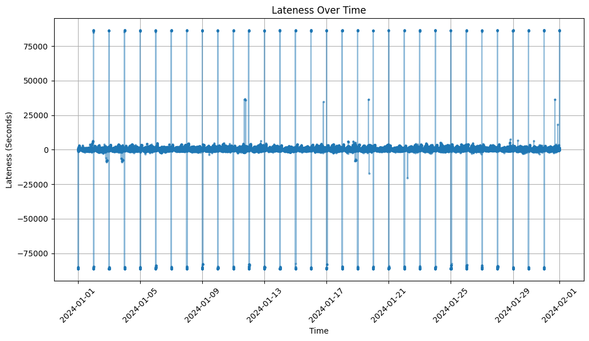

The graph above showed very weird consistent pattern of outliers. After writing down these outliers in a csv, we see that the outlier values were around 86400, which is equivalent to being one day late. By visualizing our data, we were easily able to find taht sometimes, if the expected and actual dates are different, the data is formatted so that the day that comes after is formatted as (1900-01-02T00:00:00z).

We then decided to graph the new formatted data that was now fixed. We still see there are outliers and that there are mutliple outliers back to back as shown in the graph below.

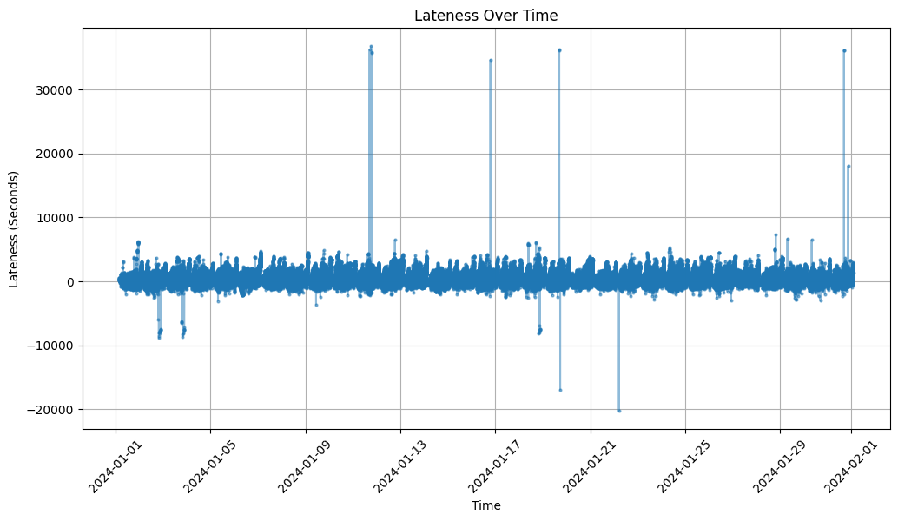

We then created a new csv looking for the outlier rows which showed that these outliers and we see they are from the same station back to back. But the intervals between the actual bus time arrivals are the same as the intervals between expected bus time arrivals. We believe that this is most likely some announced shift in the schedule that was not reflected in the spreadsheet. We decided to put an arbitrary threshold of 3600 seconds (1 hour) of lateness or earliness. After we had removed obvious outliers from our dataset, we ended up with the a visualization of the data that looked like the graph below.

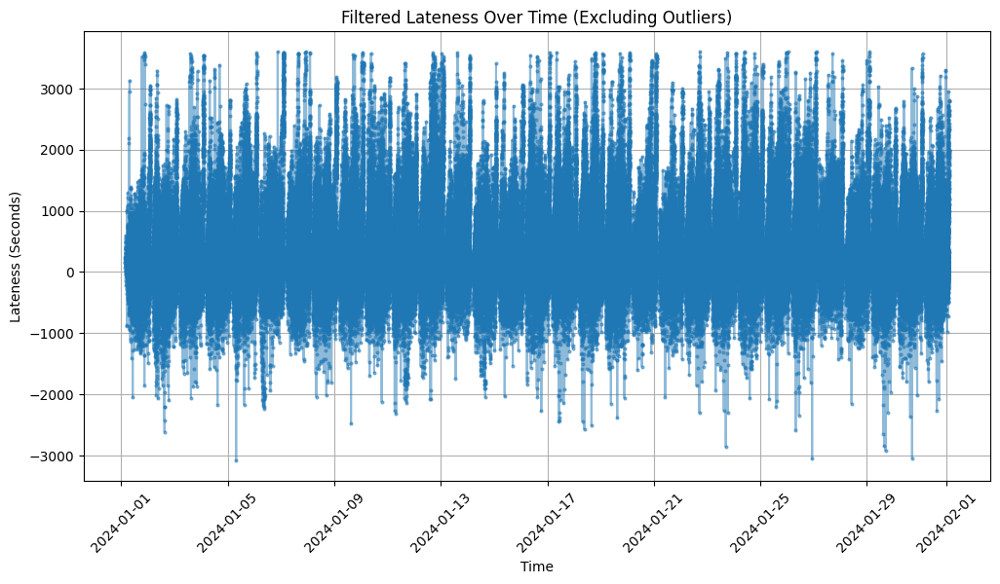

We see that the images and midterm report above all refer to 2024, but the notebook was run for years 2018 - 2024 and we can see the exact same trends for each year in regards to the type of data we saw. 2018 & 2019 required additional cleaning as their encoding method and column names were slightly different compared to the other years. If future year reports decide to change the way the data is formatted, the notebook may require modifications.

Our midterm report only discussed 2024 but now that we've processed every year, we can now answer the questions given to us fully. We thought rather than giving just a number, it would be much more meaningful to have a list of how these numbers changed yearly to see trends.

**On average, how long does an individual have to wait for a bus (on time vs. delayed)? AKA What is the average lateness per stop?**

| Year | Average Lateness (seconds) |
| ---- | -------------------------- |
| 2018 | 251.93                     |
| 2019 | 227.15                     |
| 2020 | 55.87                      |
| 2021 | 132.47                     |
| 2022 | 207.42                     |
| 2023 | 246.13                     |
| 2024 | 267.08                     |

**What is the average delay time of all routes across the entire city? AKA What is the average lateness per route?**

| Year | Average Lateness (seconds) |
| ---- | -------------------------- |
| 2018 | 249.47                     |
| 2019 | 224.46                     |
| 2020 | 53.29                      |
| 2021 | 129.69                     |
| 2022 | 205.49                     |
| 2023 | 243.43                     |
| 2024 | 263.72                     |

**What is the average delay time of the target bus routes (22, 29, 15, 45, 28, 44, 42, 17, 23, 31, 26, 111, 24, 33, 14 - from Livable Streets report)?**

| Route ID | 2018   | 2019   | 2020   | 2021   | 2022   | 2023   | 2024   |
| -------- | ------ | ------ | ------ | ------ | ------ | ------ | ------ |
| 14       | 104.60 | 151.53 | 81.48  | 362.60 | 151.88 | 241.04 | 292.39 |
| 15       | 213.60 | 215.40 | 122.91 | 116.68 | 131.38 | 209.53 | 271.07 |
| 17       | 200.08 | 178.26 | 115.96 | 138.79 | 231.29 | 296.23 | 364.31 |
| 22       | 281.35 | 239.11 | 45.13  | 86.58  | 141.89 | 333.69 | 381.42 |
| 23       | 336.86 | 307.32 | 40.57  | 76.29  | 145.55 | 267.73 | 374.58 |
| 24       | 288.50 | 314.67 | 158.92 | 282.88 | 311.76 | 282.05 | 374.80 |
| 26       | 338.36 | 263.76 | 140.92 | 124.30 | 229.85 | 103.34 | 153.85 |
| 28       | 153.73 | 198.09 | 3.63   | -6.75  | 138.29 | 333.37 | 445.83 |
| 29       | 422.18 | 412.75 | 203.67 | 214.12 | 274.37 | 499.45 | 487.36 |
| 31       | 282.06 | 263.27 | 95.97  | 155.06 | 175.59 | 220.50 | 258.80 |
| 33       | 298.18 | 268.94 | 137.17 | 154.05 | 222.42 | 261.20 | 181.02 |
| 42       | 179.81 | 164.04 | 63.38  | 181.53 | 247.90 | 225.59 | 312.93 |
| 44       | 234.11 | 256.20 | 139.44 | 163.43 | 238.54 | 343.10 | 402.80 |
| 45       | 233.41 | 231.34 | 166.09 | 132.88 | 209.29 | 316.55 | 361.81 |
| 111      | 112.68 | 109.18 | -22.97 | 92.04  | 186.08 | 158.93 | 195.53 |

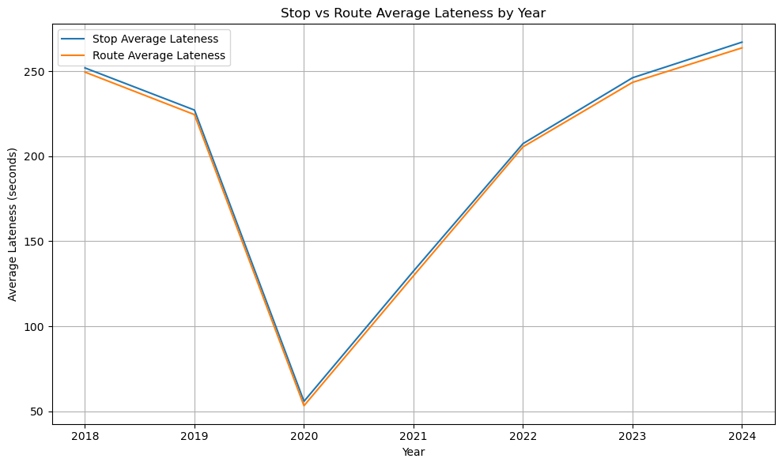

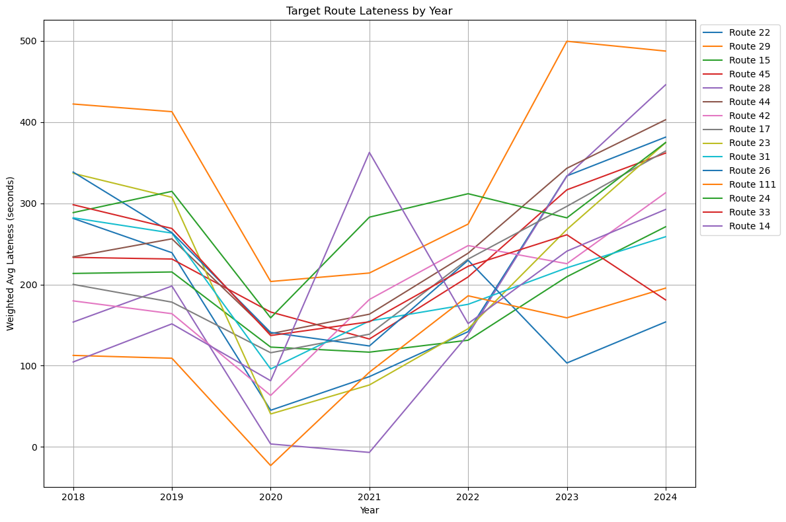

### Modeling

Since we weren't given a explicit means to model our data, we'll be taking creative liberties on what type of model we should use. We could have used one of many different ideas such as prediciting the next delay for a bus stop given a certain number of previous delays, but given the nature of the project, we can look to identify areas that could use more attention by the MBTA to promote equity. One of the main ways to do this is by identifying areas and stops in Boston that are disproportionately affected by poor bus service. By looking at groups of stops, we can focus on areas that are being affected rather than one-off stops with poor service. We can use clustering such as KMeans or DBScan to see which areas have unusually poor service.

We approached this by first using KMeans without any form of normalization. The features included the average lateness, longitude, and latitude. Since the data isn't normalized, the lateness is the only thing that becomes the focus as lateness ranges from -300 to 300 while latitude and longitutde stayed within 41 to 42 and -71 to -72. This can be shown below.

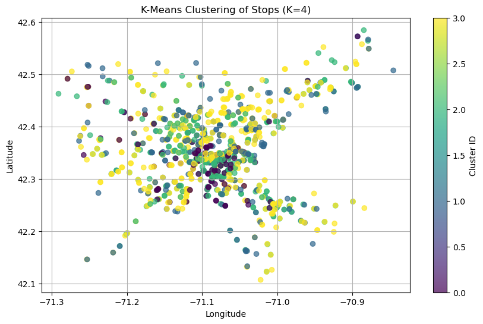

We then try adding normalization to ensure that location is being factored and we can see that the clusters begin to actually factor in distance. We also add the elbow method by looking at different cost functions after applying different number of clusters. We then decided that 7 clusters was the best choice. The 2 graphs below demonstrate this.

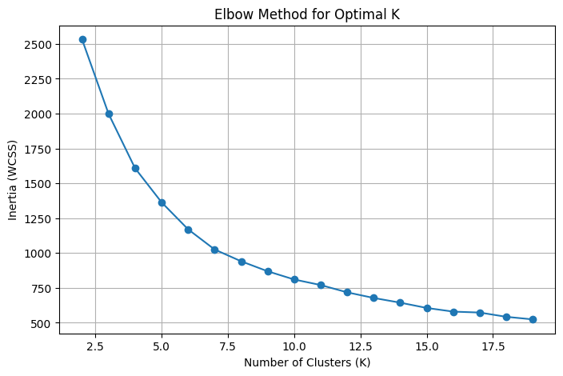

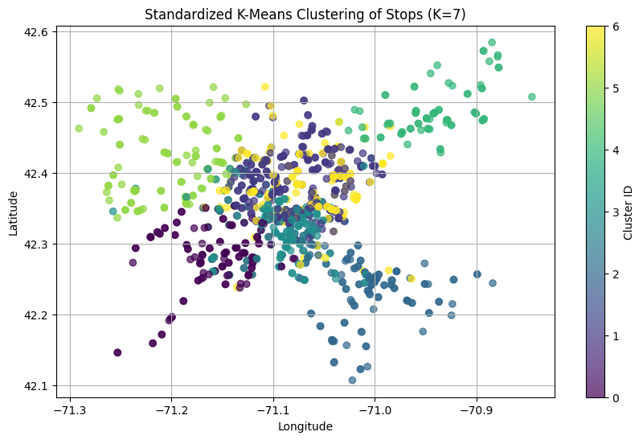

We then did the same with DBScan. The parameters were picked by looking for clusters that would have high average_lateness and non-trivial amount of stops. By manually messing around with the epsilon and min_samples parameter, we landed on 0.2 and 7 respectively.

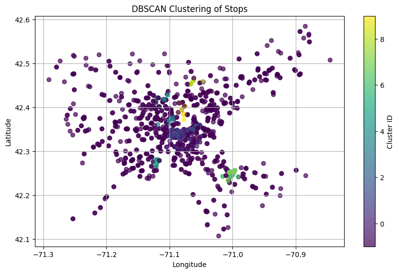

We then perform this method on each year to get K-Means and DBScan data. We then highlight the clusters that have the highest amount of lateness to determine which areas may be problematic. After creating a GIF of each year, we get varying results.

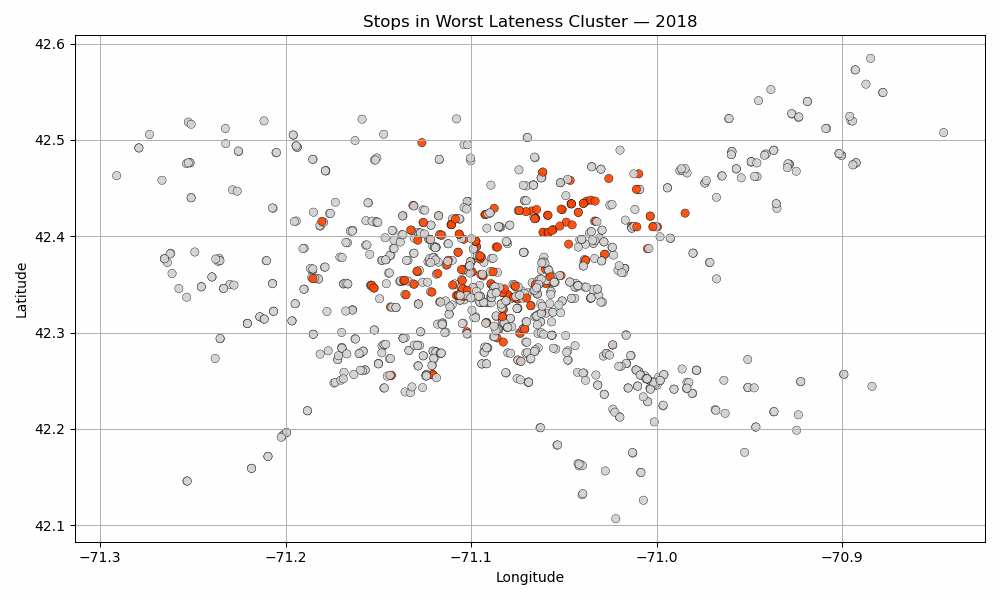

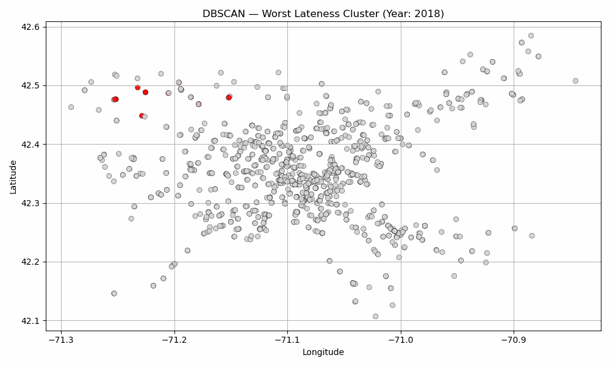

### Results

The results were posted on [ArcGIS](https://bucas.maps.arcgis.com/apps/mapviewer/index.html?webmap=bf72597e2856402d934fe400e54f2869) if users want to see the visualizations on a actual map. Ensure that the correct layer you want to view is selected on the left and that the other layer is off. Also ensure that the correct timing intervals are selected on the bottom. (11 Months for KMeans Worst Cluster By Year & 2 months for Monthly Lateness Per Stop). This should result in most smooth viewing experience. The DBScan results were too suboptimal and were not included in ArcGIS.

Analysing our findings we see a very noticable trend on overall route, stop, and target routes. With an exception of a few routes, we see a sharp drop in bus lateness during 2020 and 2021, when COVID-19 restrictions were taking place. This makes sense as less people are traveling due to both lockdown measures, social distancing, and people less comfortable sharing enclosed spaces with others. This meant less cars on roads and less stops the drivers needed to take. This gives us a sanity check that the data we've processed so far has been processed somewhat correctly. We also notice another trend: overall and most bus routes and stops have increased in lateness compared to pre-COVID. It's hard to pinpoint what this could exactly be. It could be that MBTA scaled down operations due to lowered demand and has failed to recover after demand has returned to normal. Perhaps there's just more people taking public transportation causing more traffic, perhaps there's more cars on the road in general. It's impossible to pinpoint exactly what could be causing this. We will attempt looking at all the datasets together and see if we can answer these questions.

In regards to DBScan, we were unable to find parameters that gave consistent results between years. Any parameters that worked well for covid (2020-2021) years meant that the restrictions were too strict and didn't work well. If it worked well on non-covid (2018, 2022-2024) years, it would select every point in the covid years. This indicated to us that there was not a high discrepancy between stops during covid years compared to non covid years as if more points were selected, it would have meant that the lateness must've been close enough that every point was considered a neighbor.

In regards to KMeans, we got much more promising results. The clustering shows a distinct shift of the worst lateness cluster go from North to South. I was curious as to see if lateness shifts from North to South because infrastructure in the North was bad and led to South being the next issue to solve.

| Year | Average Lateness (seconds) |
| ---- | -------------------------- |
| 2018 | 419.90                     |
| 2019 | 393.35                     |
| 2020 | 170.48                     |
| 2021 | 289.67                     |
| 2022 | 425.76                     |
| 2023 | 513.98                     |
| 2024 | 438.85                     |

But we see that average lateness in the South is higher during 2024 and 2023 compared to 2018 and 2019. It's hard to tell what caused this shift here as well, and we're not confident as to what could've caused geographic shift compared to our theories on overall raised lateness that it would be pure speculation. Hopefully we can make better sense of this data after combining all our findings.

---

# Rider Survey Data Integration and Analysis

To explore which rider characteristics are most correlated with bus lateness, we utilized both pre-COVID (2015–2017 survey + 2018 arrival/departure data) and post-COVID (2023) MBTA datasets.

## Data Collection & Processing

**Post-COVID (2023):**  
We loaded the 2023 rider survey CSV, filtered for `service_mode == Bus`, dropped nulls, standardized category names, and scaled the survey’s “weighted_percent” from 0–1 to 0–100. We then built a `full_category` label (`measure: category`) for easy comparison.

**Pre-COVID (2015–2017):**  
Because the CTPS dashboard only exposed eight demographic tables as dynamically-loaded tabs, we ran `rider_survey_scraper.py` (requests-html + pyppeteer) to dump each tab into a `.txt` file. We then parsed those into eight `.xlsx` tables (one per demographic), loaded them all, normalized each route’s counts into percentages, and pivoted into a long format with columns `(Route, full_category, pre_covid_percent)`.

We aligned naming conventions across the two eras by mapping each pre-COVID “measure: subcategory” to our post-COVID `full_category`.

## Pre- vs. Post-COVID Category Comparison

We merged the two long-form tables on `full_category`, grouped by survey measure (Income, Race, Access Mode, etc.), and displayed side-by-side comparison tables.  
Top changes overall included:

- Trip Purpose: Home-based Work  
- Trip Frequency: 5 days a week  
- Fare Type:*Monthly Pass  

These shifts likely reflect remote-work adoption and economic changes after Covid.

## Lateness-Weighted Category Analysis (Post-COVID)

1. Compute average lateness per route in 2023 (capping outliers at ±1 hour).  
2. Select “late” routes whose mean lateness exceeds the citywide average.  
3. Filter the 2023 rider survey to only those late routes.  
4. Compute, for each survey measure, the top 3 rider categories by average percent.  
5. Visualize with grouped bar charts.

Among the highest on late routes:

- **Access:** Walked or Bicycled  
- **Alternative Mode:** No  
- **Income:** Low-income (Yes)  
- **English Ability:** Never  

These results highlight riders who may be most transit-dependent or face language barriers.

We then ran K-means clustering on the full demographic profile of each late route, and a PCA projection confirmed three distinct clusters—Cluster 2 had the worst lateness and the most marginalized profiles.

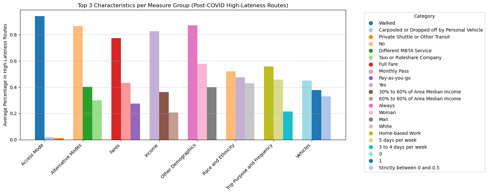

## Lateness-Weighted Category Analysis (Pre-COVID)

Because 2015–2017 lacked arrival/departure logs, we used **2018 MBTA departure CSVs** to replicate the same lateness steps:

1. Compute average lateness per route (±1 hr cap).  
2. Identify late routes (above citywide mean).  
3. Filter 2015–2017 survey to those routes.  
4. Rank the top demographic categories.

**Example top categories in 2018 late routes:**

- **Trip Purpose:** Home-based Work  
- **Low-income:** No  
- **Access:** Walked or Bicycled  
- **License:** Yes  

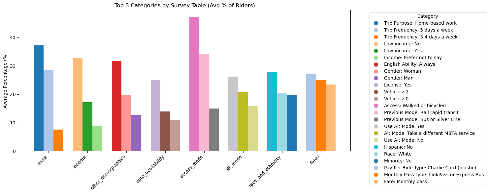

## Pre vs. Post-COVID Change in Top Categories

To see how these high-lateness profiles shifted:

1. Took the top 2–3 categories per measure from the **2018 late-route survey**.  
2. Looked up those same `full_category` labels in the **2023 late-route survey**.  
3. Computed **percent-point change** (Post – Pre).

We plotted these changes by survey measure:

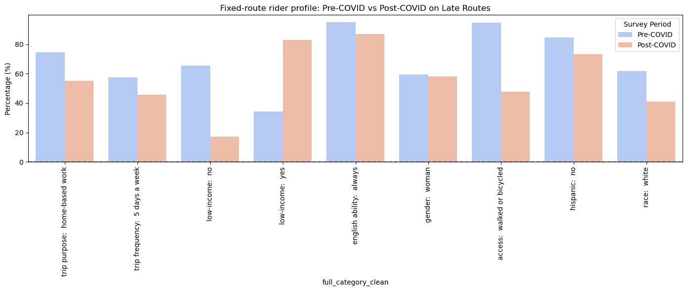

## Results and Summary

### Note/Caveat: Binary-Pair Skew

Because we compared only the top few categories—often one “yes” vs. its complementary “no”—our percent-point changes can appear exaggerated. In reality, a large swing in a binary pair (e.g. “Low-income: Yes” vs. “Low-income: No”) will force the complementary category to move equally in the opposite direction. Readers should bear this in mind when interpreting large changes in these category measures.

### Summary of Findings

- **Remote-work trends:**  
  - *Trip Purpose:* “Home-based work” share fell from ~37 % in 2018 to ~56 % in 2023 on late routes—reflecting more non-work trips (e.g. errands, medical).  
  - *Trip Frequency:* 5-day-a-week riders dropped from ~29 % to ~44 % after COVID, confirming fewer daily commuters.

- **Fare shifts:**  
  - **Monthly passes** climbed as the dominant fare product, while pay-per-ride and shorter passes declined—consistent with riders preferring prepaid plans in a more uncertain travel environment.

- **Equity impacts on late routes:**  
  - **Low-income “Yes”** rose sharply on routes with above-average lateness (from ~17 % to ~82 %), while **Low-income “No”** fell, suggesting the financial vulnerability of riders on unreliable lines.  
  - **Non-English speakers** (“English Ability: Never”) and those **without alternative modes** (“Used Alternative Mode: No”) also increased, highlighting language and mobility barriers.

### Answering the Spark! Questions

1. **Can we chart changes over TIME?**  
   - We built **Pre- vs. Post-COVID bar charts** for each demographic category, directly comparing 2018 vs. 2023 percentages.  
   - Although our data has only two “snapshots,” the same pipeline can ingest additional year-specific survey files to produce a true time-series.

2. **Are there disparities in the service levels of different routes?**  
   - We computed **average lateness per route** (capping outliers ±1 hr) across all trips in 2018 and 2023.  
   - By flagging routes whose average lateness exceeded the citywide mean, we isolated the “slowest” lines and examined their rider profiles.  
   - This approach reveals which routes consistently underperform and which rider groups (low-income, limited-English, etc.) bear the brunt of those delays.  

---

# MBTA Ridership Dataset
## Overview of the Data

The ridership dataset spans from 2016 to 2024 and includes information on the number of passengers boarding and exiting at each stop. This data allows us to analyze trends in ridership before and after COVID-19. Two separate notebooks were used to process and analyze this data:

1. **Notebook 1:** Focuses on calculating the change in ridership before and after COVID-19 by analyzing boardings.
2. **Notebook 2:** Focuses on stop-level traffic by combining boarding and exiting data and mapping it to geographic coordinates.

However, in the final report with all notebooks merged, it has been separated into three parts: 

1. **Pre-Covid** ridership at each given stop 
2. **Post-Covid** ridership at each given stop 
3. **Absolute change** in ridership if we were to consider all the stops 
## Data Processing

The data processing involved cleaning and preparing the datasets for analysis. Key steps included:

1. **Handling Missing Values:**  
   NaN values were removed from critical columns to ensure data integrity during analysis.

2. **Merging Tables:**  
   Relevant tables, such as stop-level data and ridership data, were merged using common keys like `stop_id` to enrich the dataset with additional attributes (e.g., latitude and longitude). This was done only on the pre-covid and post-covid areas since the absolute change was done regardless of location

3. **Column Cleanup:**  
   Unnecessary columns were dropped to streamline the dataset and focus on the variables required for analysis.

These steps ensured that the data was clean, consistent, and ready for further exploration and modeling.

## Detailed Description of the Data Modeling Methods Used

For modeling, we used **KMeans** initially without doing any normalization. In the first **KMeans**, the features include all metrics we have left in the model being just the latitude, longitude, and traffic. Similar to lateness, we see similar results where this clustering is mainly based on traffic.

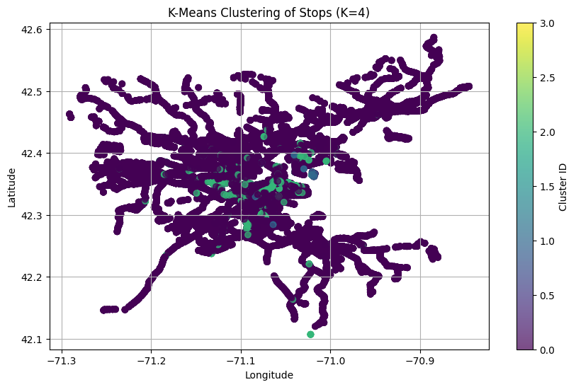
### Pre-COVID KMeans Clustering Results (With Normalization)

| Cluster | Average Traffic |
| ------- | --------------- |
| 0       | 45.56           |
| 1       | 2526.63         |
| 2       | 686.19          |
| 3       | 7772.64         |

### Post-COVID KMeans Clustering Results (With Normalization)

| Cluster | Average Traffic |
| ------- | --------------- |
| 0       | 33.56           |
| 1       | 1803.23         |
| 2       | 515.62          |
| 3       | 4572.40         |
### Observations (Without Normalization)

- **Cluster 3** consistently had the highest traffic in both pre- and post-COVID datasets, indicating areas with the most ridership.
- The clustering was heavily influenced by traffic values, with geographic factors playing a minimal role due to the lack of normalization.
- Post-COVID, the average traffic in most clusters decreased, reflecting the overall decline in ridership.
These results highlighted the need for normalization to ensure that all features (traffic, latitude, and longitude) were equally weighted in the clustering process. This step was crucial for uncovering geographic patterns in addition to traffic-based groupings.
### Pre-Covid Table

| Cluster | Average Traffic |
| ------- | --------------- |
| 0       | 70.75           |
| 1       | 20.41           |
| 2       | 40.08           |
| 3       | 3584.23         |
| 4       | 28.78           |
| 5       | 76.77           |
| 6       | 949.65          |

### Post-Covid Table

| Cluster | Average Traffic |
| ------- | --------------- |
| 0       | 21.46           |
| 1       | 53.87           |
| 2       | 18.59           |
| 3       | 2653.60         |
| 4       | 50.59           |
| 5       | 712.54          |
| 6       | 26.83           |
### Pre COVID DBScan
.png)
### Post COVID DBScan
.png)
### Insights from Clustering

- **High-Traffic Areas:** Cluster 3 consistently exhibited the highest traffic levels in both pre- and post-COVID datasets, primarily concentrated in the **Back Bay and Bay Village areas**.
- **Geographic Trends:** Normalized KMeans clustering revealed clear geographic distinctions, with some clusters representing densely populated urban centers and others highlighting low-traffic suburban stops.
- **Impact of COVID-19:** While the overall clustering patterns remained consistent, most clusters experienced a decline in average traffic post-COVID, reflecting the broader reduction in ridership.

These findings provide valuable insights into ridership dynamics and identify areas that may benefit from targeted improvements or resource allocation.
## Results

Similar to lateness, the ridership data was posted on [ArcGIS](https://bucas.maps.arcgis.com/apps/mapviewer/index.html?webmap=bf72597e2856402d934fe400e54f2869) for users to explore the visualizations on a map. Ensure that the correct layer is selected on the left and that other layers are turned off. Additionally, select the appropriate timing intervals at the bottom .

Analyzing the ridership data across the system, we observe a **widespread decline in ridership starting in 2020**, corresponding to the onset of COVID-19. This drop is evident at nearly every stop and on nearly every route, with only a few exceptions. These exceptions typically involved stops in essential-service areas or those with limited alternative transit options.

Across the board, the most significant reductions occurred in previously high-traffic clusters. In our **KMeans clustering results**, we consistently saw that **Cluster 3**—the highest-traffic group pre-COVID—experienced a noticeable drop in average ridership post-COVID. For example:

| Cluster | Avg. Traffic (Pre-COVID) | Avg. Traffic (Post-COVID) |
|--------|---------------------------|----------------------------|
| 3      | 3584.23                  | 2653.60                  |

This reflects an approximately **25% drop in traffic** for the busiest group of stops. The pattern was similar across other clusters, though the decline was more modest in lower-traffic groups.

Another key insight came from the **normalized KMeans clustering**, which gave more weight to geographic location. This revealed that **urban core areas like Back Bay and Bay Village** consistently remained in the highest ridership clusters both before and after the pandemic, although with reduced volume. Meanwhile, outer neighborhoods and suburban stops saw an even steeper decline and were often grouped into low-ridership clusters post-COVID.

The **absolute change in ridership**, calculated across all stops regardless of location, reinforced this trend, indicating a decrease by around 559 rider per season. From our analysis, there was no evidence of a full recovery to pre-pandemic levels by 2024, suggesting lasting changes in commuting patterns or public behavior. Ridership remains below pre-COVID benchmarks across nearly all metrics.

These findings provide a clear picture of how public transit usage dropped significantly during COVID-19 and has yet to fully rebound. The clustering approach not only quantified these trends but also highlighted **which areas were most affected**, offering potential guidance for where recovery efforts or service adjustments might be most needed.
