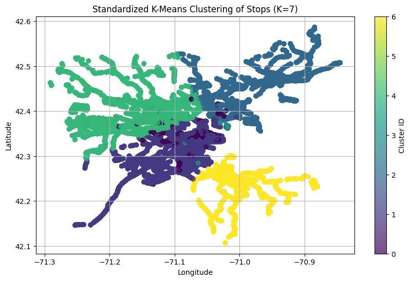
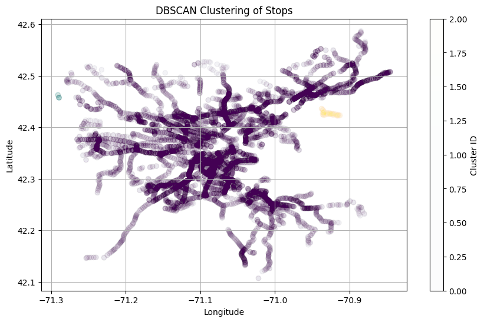

# Final Report & Presentation

YouTube Presentation Video (Place Here)

## MBTA Bus Arrival Departure Dataset

### Basic Introduction of Datasets

We have access to the expected and actual arrival data everyday from the year 2018-2025. The detail of the data is in minute accuracy and provides a lot of detailed information.

### Data Processing & Visualizations

A lot of the data processing was a direct consequence by looking at visualizations of data. For example, we later mention how date and time is formatted in the dataset. The format of the data was in DATE (i.e. 2024-01-07) with an included scheduled and actual stop TIME (formatted in 1900-01-01T00:00:04:00Z). The initial dataset was merged to slice off the 1900-01-01 and append the date to the time. But this proved to be inaccurate and was found thanks to visualizations when we visualized lateness over time.

The graph above showed very weird consistent pattern of outliers. After writing down these outliers in a csv, we see that the outlier values were around 86400, which is equivalent to being one day late. By visualizing our data, we were easily able to find taht sometimes, if the expected and actual dates are different, the data is formatted so that the day that comes after is formatted as (1900-01-02T00:00:00z).

We then decided to graph the new formatted data that was now fixed. We still see there are outliers and that there are mutliple outliers back to back as shown in the graph below.

We then created a new csv looking for the outlier rows which showed that these outliers and we see they are from the same station back to back. But the intervals between the actual bus time arrivals are the same as the intervals between expected bus time arrivals. We believe that this is most likely some announced shift in the schedule that was not reflected in the spreadsheet. We decided to put an arbitrary threshold of 3600 seconds (1 hour) of lateness or earliness. After we had removed obvious outliers from our dataset, we ended up with the a visualization of the data that looked like the graph below.

We see that the images and midterm report above all refer to 2024, but the notebook was run for years 2018 - 2024 and we can see the exact same trends for each year in regards to the type of data we saw. 2018 & 2019 required additional cleaning as their encoding method and column names were slightly different compared to the other years. If future year reports decide to change the way the data is formatted, the notebook may require modifications.

Our midterm report only discussed 2024 but now that we've processed every year, we can now answer the questions given to us fully. We thought rather than giving just a number, it would be much more meaningful to have a list of how these numbers changed yearly to see trends.

**On average, how long does an individual have to wait for a bus (on time vs. delayed)? AKA What is the average lateness per stop?**

| Year | Average Lateness (seconds) |
| ---- | -------------------------- |
| 2018 | 251.93                     |
| 2019 | 227.15                     |
| 2020 | 55.87                      |
| 2021 | 132.47                     |
| 2022 | 207.42                     |
| 2023 | 246.13                     |
| 2024 | 267.08                     |

**What is the average delay time of all routes across the entire city? AKA What is the average lateness per route?**

| Year | Average Lateness (seconds) |
| ---- | -------------------------- |
| 2018 | 249.47                     |
| 2019 | 224.46                     |
| 2020 | 53.29                      |
| 2021 | 129.69                     |
| 2022 | 205.49                     |
| 2023 | 243.43                     |
| 2024 | 263.72                     |

**What is the average delay time of the target bus routes (22, 29, 15, 45, 28, 44, 42, 17, 23, 31, 26, 111, 24, 33, 14 - from Livable Streets report)?**

| Route ID | 2018   | 2019   | 2020   | 2021   | 2022   | 2023   | 2024   |
| -------- | ------ | ------ | ------ | ------ | ------ | ------ | ------ |
| 14       | 104.60 | 151.53 | 81.48  | 362.60 | 151.88 | 241.04 | 292.39 |
| 15       | 213.60 | 215.40 | 122.91 | 116.68 | 131.38 | 209.53 | 271.07 |
| 17       | 200.08 | 178.26 | 115.96 | 138.79 | 231.29 | 296.23 | 364.31 |
| 22       | 281.35 | 239.11 | 45.13  | 86.58  | 141.89 | 333.69 | 381.42 |
| 23       | 336.86 | 307.32 | 40.57  | 76.29  | 145.55 | 267.73 | 374.58 |
| 24       | 288.50 | 314.67 | 158.92 | 282.88 | 311.76 | 282.05 | 374.80 |
| 26       | 338.36 | 263.76 | 140.92 | 124.30 | 229.85 | 103.34 | 153.85 |
| 28       | 153.73 | 198.09 | 3.63   | -6.75  | 138.29 | 333.37 | 445.83 |
| 29       | 422.18 | 412.75 | 203.67 | 214.12 | 274.37 | 499.45 | 487.36 |
| 31       | 282.06 | 263.27 | 95.97  | 155.06 | 175.59 | 220.50 | 258.80 |
| 33       | 298.18 | 268.94 | 137.17 | 154.05 | 222.42 | 261.20 | 181.02 |
| 42       | 179.81 | 164.04 | 63.38  | 181.53 | 247.90 | 225.59 | 312.93 |
| 44       | 234.11 | 256.20 | 139.44 | 163.43 | 238.54 | 343.10 | 402.80 |
| 45       | 233.41 | 231.34 | 166.09 | 132.88 | 209.29 | 316.55 | 361.81 |
| 111      | 112.68 | 109.18 | -22.97 | 92.04  | 186.08 | 158.93 | 195.53 |

### Modeling

Since we weren't given a explicit means to model our data, we'll be taking creative liberties on what type of model we should use. We could have used one of many different ideas such as prediciting the next delay for a bus stop given a certain number of previous delays, but given the nature of the project, we can look to identify areas that could use more attention by the MBTA to promote equity. One of the main ways to do this is by identifying areas and stops in Boston that are disproportionately affected by poor bus service. By looking at groups of stops, we can focus on areas that are being affected rather than one-off stops with poor service. We can use clustering such as KMeans or DBScan to see which areas have unusually poor service.

We approached this by first using KMeans without any form of normalization. The features included the average lateness, longitude, and latitude. Since the data isn't normalized, the lateness is the only thing that becomes the focus as lateness ranges from -300 to 300 while latitude and longitutde stayed within 41 to 42 and -71 to -72. This can be shown below.

We then try adding normalization to ensure that location is being factored and we can see that the clusters begin to actually factor in distance. We also add the elbow method by looking at different cost functions after applying different number of clusters. We then decided that 7 clusters was the best choice. The 2 graphs below demonstrate this.

We then did the same with DBScan. The parameters were picked by looking for clusters that would have high average_lateness and non-trivial amount of stops. By manually messing around with the epsilon and min_samples parameter, we landed on 0.2 and 7 respectively.

We then perform this method on each year to get K-Means and DBScan data. We then highlight the clusters that have the highest amount of lateness to determine which areas may be problematic. After creating a GIF of each year, we get varying results.

### Results

The results were posted on [ArcGIS](https://bucas.maps.arcgis.com/apps/mapviewer/index.html?webmap=bf72597e2856402d934fe400e54f2869) if users want to see the visualizations on a actual map. Ensure that the correct layer you want to view is selected on the left and that the other layer is off. Also ensure that the correct timing intervals are selected on the bottom. (11 Months for KMeans Worst Cluster By Year & 2 months for Monthly Lateness Per Stop). This should result in most smooth viewing experience. The DBScan results were too suboptimal and were not included in ArcGIS.

Analysing our findings we see a very noticable trend on overall route, stop, and target routes. With an exception of a few routes, we see a sharp drop in bus lateness during 2020 and 2021, when COVID-19 restrictions were taking place. This makes sense as less people are traveling due to both lockdown measures, social distancing, and people less comfortable sharing enclosed spaces with others. This meant less cars on roads and less stops the drivers needed to take. This gives us a sanity check that the data we've processed so far has been processed somewhat correctly. We also notice another trend: overall and most bus routes and stops have increased in lateness compared to pre-COVID. It's hard to pinpoint what this could exactly be. It could be that MBTA scaled down operations due to lowered demand and has failed to recover after demand has returned to normal. Perhaps there's just more people taking public transportation causing more traffic, perhaps there's more cars on the road in general. It's impossible to pinpoint exactly what could be causing this. We will attempt looking at all the datasets together and see if we can answer these questions.

In regards to DBScan, we were unable to find parameters that gave consistent results between years. Any parameters that worked well for covid (2020-2021) years meant that the restrictions were too strict and didn't work well. If it worked well on non-covid (2018, 2022-2024) years, it would select every point in the covid years. This indicated to us that there was not a high discrepancy between stops during covid years compared to non covid years as if more points were selected, it would have meant that the lateness must've been close enough that every point was considered a neighbor.

In regards to KMeans, we got much more promising results. The clustering shows a distinct shift of the worst lateness cluster go from North to South. I was curious as to see if lateness shifts from North to South because infrastructure in the North was bad and led to South being the next issue to solve.

| Year | Average Lateness (seconds) |
| ---- | -------------------------- |
| 2018 | 419.90                     |
| 2019 | 393.35                     |
| 2020 | 170.48                     |
| 2021 | 289.67                     |
| 2022 | 425.76                     |
| 2023 | 513.98                     |
| 2024 | 438.85                     |

But we see that average lateness in the South is higher during 2024 and 2023 compared to 2018 and 2019. It's hard to tell what caused this shift here as well, and we're not confident as to what could've caused geographic shift compared to our theories on overall raised lateness that it would be pure speculation. Hopefully we can make better sense of this data after combining all our findings.

# Rider Survey Data Integration and Analysis

To explore which rider characteristics are most correlated with bus lateness, we utilized both pre-COVID (2015–2017 survey + 2018 arrival/departure data) and post-COVID (2023) MBTA datasets.

## Data Collection & Processing

**Post-COVID (2023):** The rider demographic data was available in CSV format. We filtered for `service_mode = Bus`, dropped nulls, standardized category names, and computed the percentage of riders per demographic category.

**Pre-COVID (2015–2017):** These were extracted from multiple Excel exports, which weren’t available in a file format, from CTPS's MBTA Survey Dashboard, accessed using a `requests-html + pyppeteer` scraper (`rider_survey_scraper.py`). Because the data was in raw counts, we normalized values by row to compute category-level percentages per route.

To match pre- and post-COVID datasets, we aligned category naming conventions using a full-category mapping, looking at the measure group (i.e. `access_mode`) and measure (subcategory), allowing for comparison across surveys.

## Pre- vs. Post-COVID Category Comparison

We generated comparison tables for the different category distributions before and after COVID. Some of the most significantly changed categories include:

- **Trip Purpose:** Home-based Work
- **Trip Frequency:** 5 days a week
- **Fare Type:** Monthly Pass

These shifts suggest meaningful changes in travel habits and fare usage, likely related to remote work adoption and economic impacts post-COVID.

## Lateness-Weighted Category Analysis (Post-COVID)

Using 2023 arrival/departure records, we calculated average lateness per route (after removing outliers beyond an hour). Routes with above-average lateness were selected and cross-referenced with demographic data to identify groups most affected by unreliable service.

We visualized the top 3 categories in each demographic measure group on high-lateness routes. Among the highest were:

- **Access:** Walked or Bicycled
- **Alternative Mode:** No
- **Income:** Yes (low-income)
- **English Ability:** Never

These highlight populations that may be most transit-dependent or face language barriers.

We performed **KMeans clustering** on route-level demographic features and found three clusters with clearly different lateness profiles. A **PCA projection** confirmed separability between clusters — with Cluster 2 having the highest average lateness and the most marginalized rider profiles.

## Lateness-Weighted Category Analysis (Pre-COVID)

Since arrival/departure data was not available for 2015–2017, we used **2018 MBTA arrival/departure records** to estimate pre-COVID lateness.

After computing average lateness per route, we identified routes with above-average delays and isolated their rider survey responses (from the 2015–2017 survey). We then used aggregation and ranked the top demographic categories with these high-lateness routes.

Examples of top pre-COVID categories:

- **Trip Purpose:** Home-based Work
- **Low-income:** No
- **Access:** Walked or Bicycled
- **License:** Yes

## Pre vs. Post-COVID Change in Top Categories

To assess how key demographics on high-lateness routes shifted over time, we:

1. Matched top categories (by average percentage) from the pre-COVID high-lateness routes.
2. Looked up the same categories on post-COVID high-lateness routes.
3. Calculated the percentage point change from pre- to post-COVID.

This change was visualized in a bar graph grouped by survey measure (e.g., "fares", "access_mode", "race_and_ethnicity")/

This comparison suggests how COVID-19 may have intensified the inequities already faced by riders on underperforming routes.

# MBTA Ridership Dataset

## Basic Introduction of Data

For the ridership data, we have accumulated data from 2016 - 2024 regarding the number of people who have boarded and exited at a given stop. There are two separate notebooks that were used to show this. One was the ridership which finds the objective value change before and after COVID that uses boardings.

## Data Processing

### Notebook 1:

This process was generally straightforward with removing NaN values. In order to see the effect of COVID, we processed so that the groups would be averaged from the previous to 2019 and post 2019. As such, the first notebook is simply removing other needless variables and isolating the important variables we wanted to see. In this notebook, we implemented a new variable called `absolute_change` that was made for each existing `route_id`. For broad generalizations, this notebook is almost complete with some minor fixes necessary for submission later.

### Notebook 2:

This process took a little longer as it requires us to cross reference another csv file called `stops`. Similar to lateness, ARCGIS takes in coordinates, so we simply matched the stop id to a specific coordinate. We combined the population who boarded and exited to generate a new term called `traffic` for the second notebook. This one is more specific to say that a given stop has some amount of traffic.

## Detailed Description of the Data Modeling Methods Used

For modeling, we used **KMeans** initially without doing any normalization. In the first **KMeans**, the features include all metrics we have left in the model being just the latitude, longitude, and traffic. Similar to lateness, we see similar results where this clustering is mainly based on traffic.

We then added normalization to make sure all factors are being considered. After using the elbow method, we find that the optimal number of clusters is seven as shown below.

With seven groups, we have it output the image below. The groups become more clear, and the general locations seem to be more important when considering how the points were clustered.

| Cluster | Traffic     |
| ------- | ----------- |
| 0       | 748.375705  |
| 1       | 67.359137   |
| 2       | 34.573867   |
| 3       | 2569.139219 |
| 4       | 51.438401   |
| 5       | 7772.638095 |
| 6       | 28.334925   |

After seeing those results, we then tried using a **DBScan**, but this process still needs to be explored further since the current output does not help us deduce more about the data we are working with.

## Preliminary Results

In terms of ridership, we found that in terms of absolute ridership, the amount of people riding the bus has decreased after COVID. This is clear when we look at the ridership notebook. The traffic for stops seems to be greatly divided where there are some groups seeing thousands of riders in a season and others seeing fifty. **Cluster 5** in particular seems to have the most riders. This cluster is located in the **Back Bay area up into the Bay Village area**. To have a comprehensive understanding of the problem, we will be combining this data with the other sets of data to draw better conclusions for our final report.
